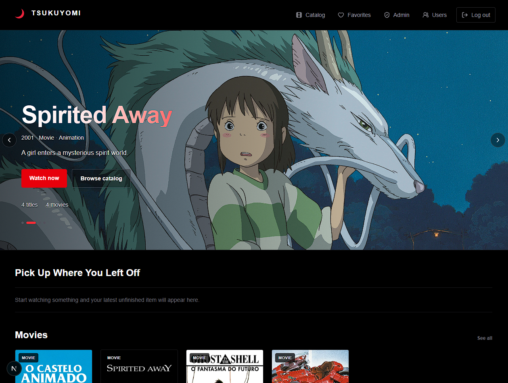
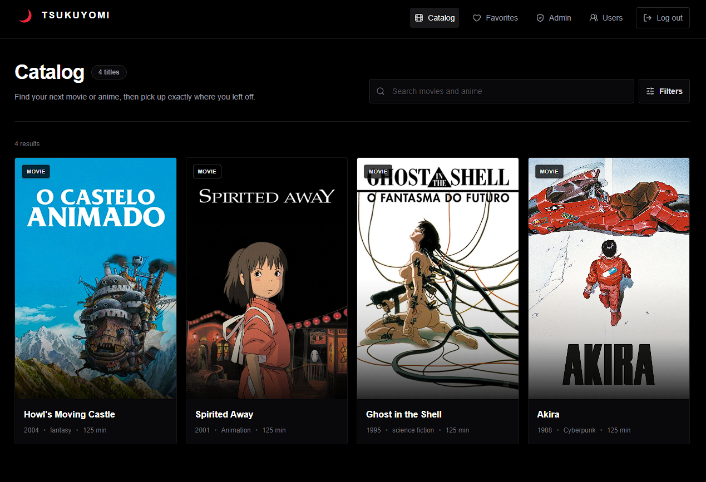

# 🌙 Tsukuyomi

Tsukuyomi is a personal Netflix-inspired streaming app for browsing movies and anime in one private library. Users can search and filter the catalog, save favorites, watch movies or anime episodes, and resume titles from their personal watch progress. Admins can manage movies, anime episodes, and user accounts through a dedicated dashboard.

## Screenshots

<div align="center">
  <p>
    
  </p>
  <p>
    
  </p>
</div>

## Features

- Movie and anime catalog with poster and backdrop images
- Search and category filters
- Movie details and anime episode management
- MP4 video playback
- Per-user watch history and playback progress
- Continue watching section
- Per-user favorites
- Login and logout with JWT authentication
- JWT stored in an HttpOnly cookie
- CSRF protection for state-changing requests
- Admin-only movie, episode, and user management
- Responsive interface for desktop and mobile
- TanStack Query for admin data fetching and automatic CRUD refreshes

There is no public registration flow. The configured admin account is created automatically when the backend starts, and admins can create additional users from the admin area.

## Tech Stack

### Backend

- Java 21
- Spring Boot 4.1.1
- Spring Web MVC
- Spring Data JPA and Hibernate
- Spring Security
- JSON Web Tokens with JJWT
- PostgreSQL
- Maven

### Frontend

- Next.js 16
- React 19
- TypeScript
- Tailwind CSS 4
- TanStack Query
- Lucide React

## Project Structure

```text
tsukuyomi/
|-- backend/     Spring Boot REST API
|-- frontend/    Next.js application
|-- .github/     GitHub configuration
```

## Requirements

- Java 21
- Node.js and npm
- PostgreSQL
- Git

## Setup

Clone the repository and enter the project directory:

```bash
git clone https://github.com/<your-username>/tsukuyomi.git
cd tsukuyomi
```

Create the PostgreSQL database:

```sql
CREATE DATABASE tsukuyomi_db;
```

### Backend

Create the local Spring configuration from the tracked example:

```bash
cd backend
cp src/main/resources/application.properties.example src/main/resources/application.properties
```

On PowerShell, use:

```powershell
Copy-Item src/main/resources/application.properties.example src/main/resources/application.properties
```

Update `application.properties` with your local PostgreSQL credentials and a private JWT secret:

```properties
spring.datasource.url=jdbc:postgresql://localhost:5432/tsukuyomi_db
spring.datasource.username=postgres
spring.datasource.password=your_database_password

spring.jpa.hibernate.ddl-auto=update
spring.jpa.show-sql=true

app.frontend-origin=http://localhost:3000
app.auth.username=admin
app.auth.password=change-this-password
app.auth.jwt-secret=change-this-to-a-long-random-secret
app.auth.jwt-expiration-minutes=1440
app.auth.cookie-secure=false
app.auth.cookie-same-site=Lax
```

Start the backend:

```bash
./mvnw spring-boot:run
```

On Windows:

```powershell
.\mvnw.cmd spring-boot:run
```

The backend runs on `http://localhost:8080`.

The admin user is seeded from `app.auth.username` and `app.auth.password` the first time the backend starts. Use those configured values to log in.

### Frontend

Open a second terminal:

```bash
cd frontend
npm install
cp .env.example .env.local
npm run dev
```

On PowerShell:

```powershell
Copy-Item .env.example .env.local
npm run dev
```

The frontend uses the backend at `http://localhost:8080` by default. To use another API URL, update `.env.local`:

```env
NEXT_PUBLIC_API_BASE_URL=http://localhost:8080
```

Open `http://localhost:3000` in your browser.

## Useful Routes

- `/` - Home page
- `/movies` - Catalog
- `/favorites` - Favorite titles
- `/movies/:id` - Movie or anime details
- `/login` - Login page
- `/admin/movies` - Admin catalog
- `/admin/movies/new` - Create a movie or anime
- `/admin/users` - Manage users
- `/api/health` - Backend health check

## Development Checks

Frontend:

```bash
cd frontend
npm run lint
npx tsc --noEmit --incremental false
npm run build
```

Backend:

```bash
cd backend
./mvnw test
```

## Security Notes

- Do not commit `backend/src/main/resources/application.properties`.
- Do not commit `frontend/.env.local`.
- Keep database passwords and JWT secrets outside version control.
- Local MP4 files under `frontend/public/media/videos` are ignored by Git.
- The current media flow uses simple MP4 URLs. Protected media delivery with HTTP Range support is planned for a later phase.

## Author

vfb-dev - Turning ideas into web apps
